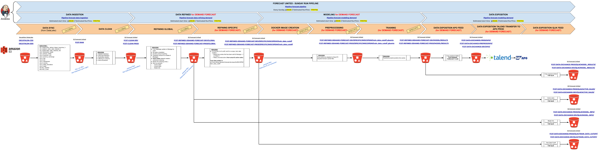
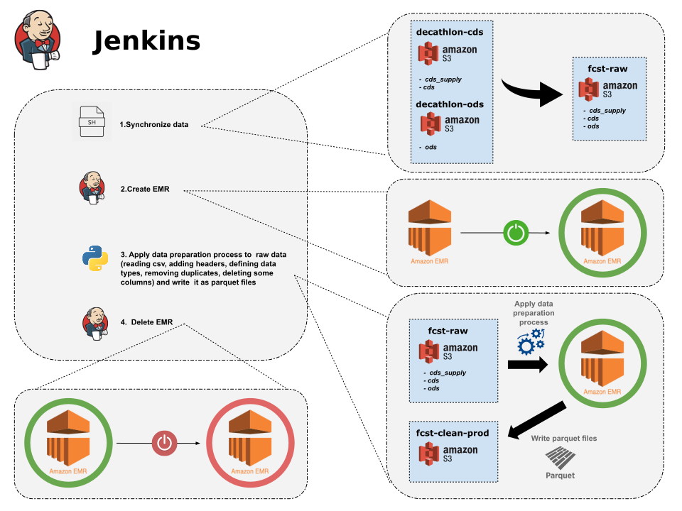

# Demand Forecast : Data Ingestion

## Table of contents
* [1. Context](#1-context)
* [2. Description](#2-description)
    * [2.1. Synchronize data](#21-synchronize-data)
    * [2.2. Create EMR](#22-create-emr)
    * [2.3. Data Ingestion process](#23-data-ingestion-process)
    * [2.4. Delete EMR](#24-delete-emr)
 * [3. Scheduling](#3-scheduling)  
    
## 1. Context

This project represents the Data Ingestion brick (with Spark) of the Demand Forecasting project for APO.

The run pipeline for the entire project is represented hereunder:


Here are the GitHub links to the other blocks of the project:
- [Data Refining](https://github.com/dktunited/forecast-data-refining-demand.git)
- [Data Modeling](https://github.com/dktunited/forecast-modeling-demand.git)
- [Monitoring](https://github.com/dktunited/forecast-monitoring.git)
- [Automation](https://github.com/dktunited/forecast-automation.git)

## 2. Description
If you run the project through Jenkins, here's an overview of what happens behind the scenes:

*[Link](https://docs.google.com/drawings/d/1QDVKNmBebDRlXa8FzKmVeJm50QoNXx5_68Rf_ajbFEU/edit) to edit this architecture*

Down below is the structure of the Data Ingestion project:
```
forecast-data-ingestion
│   .gitignore
│   Jenkinsfile
│   main_data_ingestion.py
│   main_spark.sh
│   main_synchro_aws.sh
│   README.md
│   requirements.txt
│   setup.py
│
│
├───assets
│       architecture-data-ingestion.svg
│       pipeline_modelisation.png
│
├───conf
│       dev.yml
│       functional.yml
│       logging-console.json
│       prod.yml
│
└───src
    ├───config
    │       config.py
    │       pgconf.py
    │       __init__.py
    │
    ├───preparation
    │       data_ingestion.py
    │       __init__.py
    │
    ├───tests
    │       README.md
    │
    └───tools
            constants.py
            tools.py
            __init__.py
```

*Note: The whole pipeline of this block is inside the `JenkinsFile`.*  
The main goal of this project is to prepare and transform raw csv tables into 
clean parquet files saved in a s3 bucket. 
The cleaning process includes the following operations :
- Adding headers
- Defining columns' data types
- Removing duplicates
- Removing some unwanted columns

There is a functional configuration file `conf/functionnal.yml` which allows us to:
- add new tables to process
- choose the tables to process
- define columns we want to remove from some tables
- distinguish **big tables** (tables' folders contain monthly sub-folders) from **small tables** in order to adapt 
the processing

Talking about *big tables* and *small tables*, we define  in the `conf/functionnal.yml` an integer variable **filter-time** 
which indicates the number of the latest months to process for *big tables*. Indeed, *big tables*' processing is time-consuming 
so we don't want to do it often for all months but just for the few latest months.
 
#### 2.1. Synchronize data

The first stage of the Jenkins pipeline synchronizes raw data from s3 buckets **decathlon-cds** (Only two schemas are concerned: **cds_supply** and **cds**) and **decathlon-ods** 
(Only one schema is concerned: **ods**) towards the s3 bucket **fcst-raw**. The synchronisation is just an intelligent copy (only new files or updated ones are copied). 
This synchronisation is orchestrated by a `main_synchro_aws.sh` file which takes two arguments:
- `run_env` which can either be `dev` or `prod`. This argument sets the technical configuration file to use: `dev.yml` for `dev` 
and `prod.yml` for `prod`. The configuration file does contain a mandatory integer variable `aws_sync_filter_time`  which must be 
greater or equal to `time_filter`(integer variable from `functional.yml`). This `aws_sync_filter_time` is here to limit the synchronisation 
of big tables to just the few latest months. 
It actually indicates how many latest months to synchronize  for big tables.
- `scope` which can be :
  * `scope_full`  which means that all *big tables* are **fully processed** (All months) as well as all small tables.
  * `scope_delta` which means that all *big tables* are **processed only for the few latest months** (`time_filter` latest months)
   while  all small tables are **fully processed**.
  * `scope_big_tables` which means that only *big tables* are **fully processed**.
  * `scope_small_tables` which means that only *small tables* are **fully processed**.
  * `scope_big_tables_delta` which means that only *big tables* are **processed for the 
  few latest months** (`time_filter` latest months)

Here is an example of how to execute the script of the data synchronisation:
`./main_synchro_aws.sh ${run_env} ${scope}`.

***Note***:  The synchronisation does also concern the headers' table directory `TABLE_COLUMN` coming from the s3 bucket **decathlon-cds**. This 
directory actually contains timestamped sub-folders which are all synchronized. `TABLE_COLUMN` does not appear in the functional file `functional.yml`.
  

#### 2.2 Create EMR

The second stage of the jenkins file consist of creating an **EMR cluster** for the next stage : the preparation and transformation of  raw csv tables 
into clean parquet files saved in a s3 bucket. The jenkins job `EMR-CREATE-PERSISTENT-CLUSTER` is executed for that. The configurations of the cluster 
are set directly inside the `JenkinsFile`.  

#### 2.3. Data Ingestion process

This is the stage where we tackle the main goal of the project: apply data preparation process 
to raw data and write it as parquet files in s3. It is orchestrated
by the file  `main_spark.sh` which launches  the python script `main_data_ingestion`.
The `main_spark.sh` is launched on the remote **EMR** machine created earlier in the second
stage. This `.sh` script takes the same arguments as those taken in the synchronisation 
stage. Here is an example of how this script  is executed :
`./main_spark.sh ${run_env} ${scope}`. The argument `run_env` sets the technical configuration 
file to use: `dev.yml` or `prod.yml` according to its value which can be respectively `dev` or
`prod`.

The python script `main_data_ingestion.py` which does the data preparation and writing process
takes 3 arguments:

- `technical_conf_file` which can be either `dev.yml` or `prod.yml`
- `./conf/loggin-console.json` which is the *logging* configuration file
- `scope` which can be :
  * `scope_full`
  * `scope_delta`
  * `scope_big_tables`
  * `scope_small_tables`
  * `scope_big_tables_delta`

#### 2.4. Delete EMR

This the last stage of the `JenkinsFile`. It deletes the **EMR cluster** created earlier in the second stage.
The jenkins job `EMR-DELETE-PERSISTENT-CLUSTER` is executed for that.

## 3. Scheduling

This brick is scheduled through Jenkins:
- [Jenkins job](https://forecast-jenkins.subsidia.org/view/PIPELINE-RUN/job/forecast-data-ingestion/)
- The hereinabove job is called upon by this [Run Pipeline](https://forecast-jenkins.subsidia.org/job/forecast-pipeline-demand/) job
